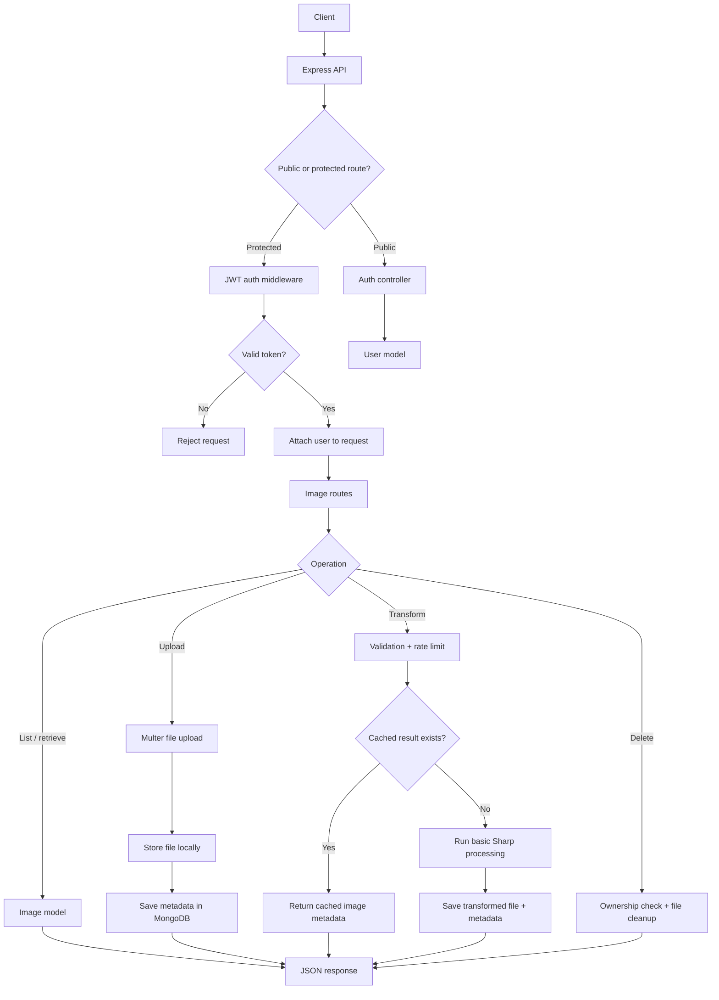

# Image Processing Backend

This is a backend service for uploading, managing, and processing images. The image transformation part is intentionally straightforward; the main focus of this project is the backend structure around authentication, protected resources, file handling, validation, database modeling, and API design.

The project is built as a small Cloudinary-style service where users can register, log in, upload images, view their own images, request basic transformations, and delete images they own.

## Backend Focus

This project showcases core backend concepts such as:

- JWT-based authentication
- Password hashing with bcrypt
- Protected routes with authentication middleware
- User ownership checks for protected resources
- MongoDB data modeling with Mongoose
- Multipart file uploads with Multer
- Request validation
- Rate limiting for expensive operations
- Pagination
- File metadata storage
- Local file cleanup when deleting records
- Transformation caching to avoid duplicate processing
- Separation of routes, controllers, middleware, models, services, and utilities

## Tech Stack

- Node.js
- Express.js
- MongoDB
- Mongoose
- JSON Web Token
- bcryptjs
- Multer
- Sharp
- express-rate-limit
- dotenv
- helmet
- cors
- Swagger UI
- Docker

## System Overview



## Project Structure

```text
src/
  config/
    db.js
    swagger.js

  controllers/
    auth.controller.js
    image.controller.js

  middleware/
    auth.middleware.js
    error.middleware.js
    upload.middleware.js
    validateObjectId.middleware.js
    validateTransform.middleware.js
    rateLimit.middleware.js

  models/
    User.js
    Image.js

  routes/
    auth.routes.js
    image.routes.js

  services/
    image.service.js

  utils/
    asyncHandler.js
    generateToken.js
    stableStringify.js

  app.js
  server.js

public/
  index.html
  styles.css
  app.js

Dockerfile
docker-compose.yml
```

## Main Functionality

The backend supports user registration and login with hashed passwords. After login, users receive a JWT, which is required for protected image routes.

Uploaded images are saved locally, while metadata such as owner, filename, path, URL, size, dimensions, format, and transformation details are stored in MongoDB.

Image operations are scoped to the authenticated user, so users can only list, retrieve, transform, or delete their own images.

Basic image processing is handled with Sharp. The transformation functionality is kept simple and currently supports operations such as resizing, rotating, flipping, mirroring, format conversion, grayscale/sepia filters, and quality control.

To avoid unnecessary duplicate work, transformed images are cached using a stable transformation key. If the same user requests the same transformation for the same original image, the API returns the existing transformed image instead of generating another file.

## Frontend Demo

The project also includes a simple frontend served directly by Express from the `public/` folder. It is not a separate React app or production UI; it is a lightweight demo client for quickly testing the backend functionality in the browser.

The frontend supports registering, logging in, uploading images, listing user-owned images, selecting an image, running transformations, opening image URLs, deleting images, and viewing raw API responses.

## API Documentation

Swagger UI is available for browsing and testing documented API routes in the browser.

```text
http://localhost:5000/api-docs
```

The Swagger setup lives in:

```text
src/config/swagger.js
```

## Environment Variables

Create a `.env` file in the project root:

```env
PORT=5000
MONGO_URI=mongodb://127.0.0.1:27017/image-processing-service
JWT_SECRET=replace_this_with_a_long_secret
JWT_EXPIRES_IN=7d
BASE_URL=http://localhost:5000
```

## Run Locally

Install dependencies:

```bash
npm install
```

Start the development server:

```bash
npm run dev
```

The API runs on:

```text
http://localhost:5000
```

The frontend demo is available at the same address:

```text
http://localhost:5000
```

Health check:

```text
GET /health
```

## Run With Docker

The project includes Docker support for running the API and MongoDB together.

Build and start the containers:

```bash
docker compose up --build
```

Then open:

```text
http://localhost:5000
```

Swagger docs:

```text
http://localhost:5000/api-docs
```

Stop the containers:

```bash
docker compose down
```

Docker Compose uses these services:

```text
api    - Node/Express backend
mongo  - MongoDB database
```
