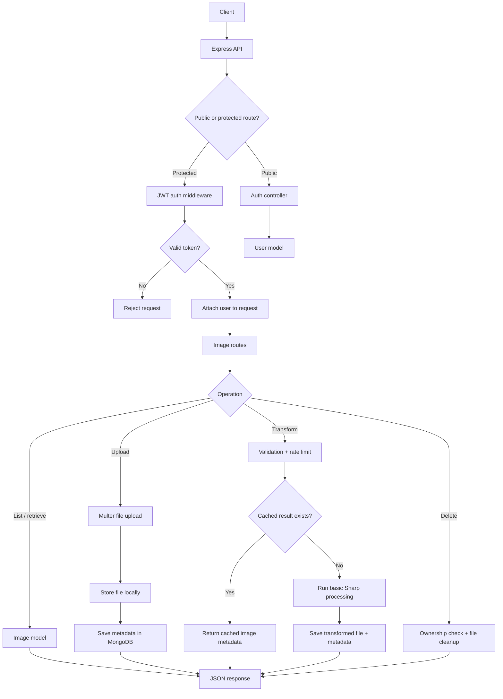

# Image Processing Backend

This is a backend service for uploading, managing, and processing images. The image transformation part is intentionally straightforward; the main focus of this project is the backend structure around authentication, protected resources, file handling, validation, database modeling, and API design.

The project is built as a small Cloudinary-style service where users can register, log in, upload images, view their own images, request basic transformations, and delete images they own.

## Backend Focus

This project showcases core backend concepts such as:

- JWT-based authentication
- Password hashing with bcrypt
- Protected routes with authentication middleware
- Role-based authorization for admin-only routes
- User ownership checks for protected resources
- MongoDB data modeling with Mongoose
- Multipart file uploads with Multer
- Storage service abstraction around local file paths, URLs, and deletion
- Request validation
- Rate limiting for expensive operations
- Upload rate limiting
- Pagination
- File metadata storage
- Local file cleanup when deleting records
- Cascade deletion for original images and their transformed children
- Transformation caching to avoid duplicate processing
- Domain audit logging for security-sensitive and admin actions
- Separation of routes, controllers, middleware, models, services, and utilities

## Tech Stack

- Node.js
- Express.js
- MongoDB
- Mongoose
- JSON Web Token
- bcryptjs
- Multer
- Sharp
- express-rate-limit
- dotenv
- helmet
- cors
- Swagger UI
- Docker

## System Overview



## Project Structure

```text
src/
  config/
    db.js
    env.js
    swagger.js

  controllers/
    admin.controller.js
    auth.controller.js
    image.controller.js
    job.controller.js

  middleware/
    auth.middleware.js
    authorize.middleware.js
    error.middleware.js
    logger.middleware.js
    upload.middleware.js
    validateObjectId.middleware.js
    validateTransform.middleware.js
    rateLimit.middleware.js

  models/
    AuditLog.js
    User.js
    Image.js
    Job.js

  routes/
    admin.routes.js
    auth.routes.js
    image.routes.js
    job.routes.js

  services/
    audit.service.js
    image.service.js
    job.service.js
    storage.service.js

  utils/
    asyncHandler.js
    generateToken.js
    refreshToken.js
    stableStringify.js

  app.js
  server.js

public/
  index.html
  styles.css
  app.js

Dockerfile
docker-compose.yml
```

## Main Functionality

The backend supports user registration and login with hashed passwords. After login, users receive a JWT access token and a refresh token. The access token is used for protected routes, while the refresh token can be used to request a new access token or log out by revoking the stored refresh token hash.

Uploaded images are saved locally, while metadata such as owner, filename, path, URL, size, dimensions, format, and transformation details are stored in MongoDB. File path generation, public URL generation, upload directory setup, and file deletion are centralized behind a storage service so the controllers are not tightly coupled to local disk storage.

Image operations are scoped to the authenticated user, so users can only list, retrieve, transform, or delete their own images.

Admin routes use role-based authorization. Normal users receive `403 Forbidden` on admin endpoints, while users with the `admin` role can inspect users, images, and background jobs across the system.

The backend also stores domain audit logs for important events such as registration, login, refresh-token usage, logout, image upload, image transformation, image deletion, transform job lifecycle events, and admin record access. Admins can query audit logs with filters and pagination.

Deleting a transformed image removes only that transformed image. Deleting an original image also deletes its transformed child images and their local files.

Basic image processing is handled with Sharp. The transformation functionality is kept simple and currently supports operations such as resizing, rotating, flipping, mirroring, format conversion, grayscale/sepia filters, and quality control.

To avoid unnecessary duplicate work, transformed images are cached using a stable transformation key. If the same user requests the same transformation for the same original image, the API returns the existing transformed image instead of generating another file.

## Frontend Demo

The project also includes a simple frontend served directly by Express from the `public/` folder. It is not a separate React app or production UI; it is a lightweight demo client for quickly testing the backend functionality in the browser.

The frontend supports registering, logging in, uploading images, listing user-owned images, selecting an image, running transformations, opening image URLs, deleting images, and viewing raw API responses.

## API Documentation

Swagger UI is available for browsing and testing documented API routes in the browser, including authentication and image management routes.

```text
http://localhost:5000/api-docs
```

The Swagger setup lives in:

```text
src/config/swagger.js
```

## API Versioning

The recommended API base path is:

```text
http://localhost:5000/api/v1
```

Example routes:

```text
POST   /api/v1/register
POST   /api/v1/login
POST   /api/v1/refresh-token
POST   /api/v1/logout
GET    /api/v1/me
POST   /api/v1/images
GET    /api/v1/images
GET    /api/v1/images/:id
DELETE /api/v1/images/:id
POST   /api/v1/images/:id/transform
POST   /api/v1/images/:id/jobs
GET    /api/v1/jobs/:id
GET    /api/v1/admin/users
GET    /api/v1/admin/images
GET    /api/v1/admin/jobs
GET    /api/v1/admin/audit-logs
```

The original root routes still work for backwards compatibility, but new clients should use `/api/v1`.

## Environment Variables

Create a `.env` file in the project root. A starter template is available in `.env.example`.

```env
PORT=5000
MONGO_URI=mongodb://127.0.0.1:27017/image-processing-service
JWT_SECRET=replace_this_with_a_long_secret
JWT_EXPIRES_IN=7d
BASE_URL=http://localhost:5000
UPLOAD_MAX_FILE_SIZE_BYTES=5242880
UPLOAD_RATE_LIMIT_WINDOW_MS=900000
UPLOAD_RATE_LIMIT_MAX=20
TRANSFORM_RATE_LIMIT_WINDOW_MS=900000
TRANSFORM_RATE_LIMIT_MAX=10
```

Environment handling is centralized in `src/config/env.js`. The app validates required variables on startup and provides defaults for optional runtime settings like upload size and rate limits.

## Run Locally

Install dependencies:

```bash
npm install
```

Start the development server:

```bash
npm run dev
```

The API runs on:

```text
http://localhost:5000
```

The frontend demo is available at the same address:

```text
http://localhost:5000
```

Health check:

```text
GET /health
```

## Run With Docker

The project includes Docker support for running the API and MongoDB together.

Build and start the containers:

```bash
docker compose up --build
```

Then open:

```text
http://localhost:5000
```

Swagger docs:

```text
http://localhost:5000/api-docs
```

Stop the containers:

```bash
docker compose down
```

Docker Compose uses these services:

```text
api    - Node/Express backend
mongo  - MongoDB database
```
